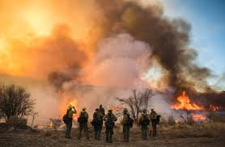
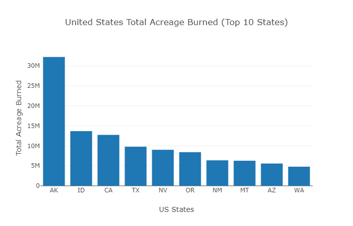
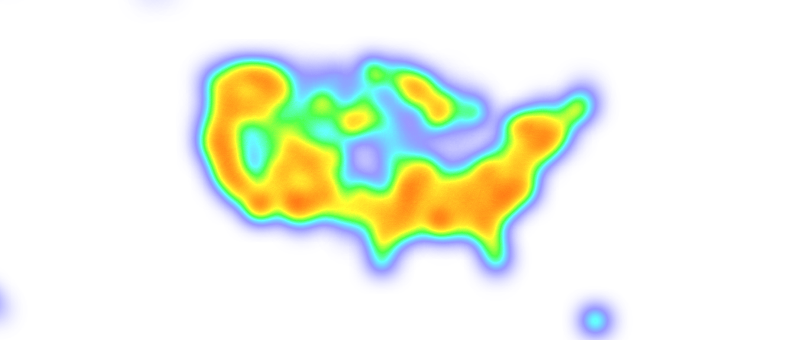

# Project-Wildfire

# Background
The purpose of this project is to analyze U.S. Wildfire historical data for the United States.
To accomplish this analysis, we pulled data from the kaggle dataset containing 1.88 million US wildfires, 24 years of geo-referenced wildfire records.
The data publication contains a spatial database of wildfires that occurred in the US from 1992 to 2015. The wildfire records were acquired from the reporting systems of federal, state, and local fire organizations. The following core data elements were required for records to be included in this data publication: discovery date, final fire size, and a point location  
After assembling the dataset, tools used for analysis included Javascript, Plotly, D3, Leaflet, and Flask among others.
Factors analyzed includes: wildfire geographic location, acreage burned, causes of wildfire, and number of wildfires.  This page provides the source data and visualizations created as part of the analysis, as well as explanations and descriptions of any trends and correlations witnessed.

# Analysis and Insights

# Pie Chart

.png)
- Clearly shows that the top causes of wildfires is due to human action. - Debris and

# Line Chart 

![newplot_line][(images/newplot_line.png)
- Indicates an increasingly upwards trend in the total number of fires across all States in the USA.

# Bar Chart 

- Highlights the top States with the largest acres burned - California, Georgia, Texas, North Carolina,Florida.

# Heat Map 

- Most of the fires are concentrated in the urban areas lending further credence to the fact that Humans are the largest causes of wildfires.

# The trend analysis shows that areas that were not previously subjected to wildfires in the early 90's now have a high propensity to fires as the human population expands into these areas.
